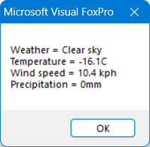
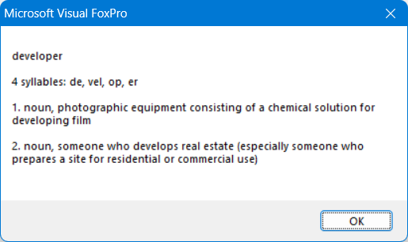
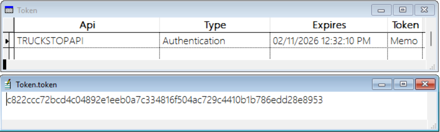

# Documentation for VFPREST

## Base REST class

BaseREST in BaseREST.prg is the base class for classes that call REST APIs. It has the properties shown below. Most of these properties are protected so they're only intended to be used or overridden in a subclass. Note that there are a few other properties, but they're for internal use and wouldn't likely be touched in a subclass.

| Property      | Scope     | Description                                                                                                                                                                                                                                           |
|---------------|-----------|-------------------------------------------------------------------------------------------------------------------------------------------------------------------------------------------------------------------------------------------------------|
| cErrorMessage | Public    | The message for any error that occurred.                                                                                                                                                                                                              |
| cLogFile      | Public    | The path for a log file containing debugging information about API calls (only used if lLogging is .T.). The Assign method for this property automatically adds a timestamp to the name.                                                              |
| lLogging      | Public    | Set to .T. to log information about the API calls to a text file specified in cLogFile.                                                                                                                                                                |
| cHTTPClass    | Protected | The class for the HTTP object. Defaults to "WinHttp.WinHttpRequest.5.1". Set it to "wwHTTPREST" and cHTTPLibrary to "wwHTTPREST.prg" to use a subclass of wwHTTP.                                                                                     |
| cHTTPLibrary  | Protected | The library for the class specified in cHTTPClass; defaults to blank.                                                                                                                                                                                 |
| cINIFile      | Protected | The name of the INI file containing settings; defaults to "api.ini". This isn't required but is handy for things such as encrypted credentials. If the INI file isn't named api.ini, pass the name of the file to use when the class is instantiated. |
| cINISection   | Protected | The section in the INI file containing settings for this class.                                                                                                                                                                                       |
| cResultCode   | Protected | The result of the API call.                                                                                                                                                                                                                           |
| cURL          | Protected | The URL to call.                                                                                                                                                                                                                                      |
| oResponse     | Protected | A reference to an object deserialized from the JSON string returned by the API call.                                                                                                                                                                  |

By default, BaseREST uses WinHttp.WinHttpRequest.5.1 to perform API calls. You may prefer to use West Wind Technologies' wwHTTP class instead. wwHTTPRest is a subclass of wwHTTP that provides a similar interface to WinHttp.WinHttpRequest.5.1 so BaseREST doesn't have to handle wwHTTP differently.

BaseREST has the methods shown below; all are protected methods. Note that there are a few other methods, but they're for internal use and would not likely be called or overridden in a subclass.

| Method            | Description                                                                                                                                                                                                            | Parameters                                                                                                                                                                                                                                                                                                                                                         |
|-------------------|------------------------------------------------------------------------------------------------------------------------------------------------------------------------------------------------------------------------|--------------------------------------------------------------------------------------------------------------------------------------------------------------------------------------------------------------------------------------------------------------------------------------------------------------------------------------------------------------------|
| AddPostKey        | Add a post key parameter                                                                                                                                                                                               | tcKey: the key for post value<br>tcValue: the value for the post value                                                                                                                                                                                                                                                                                             |
| AddQueryString    | Add a query string parameter                                                                                                                                                                                           | tcKey: the key for query parameter<br>tcValue: the value for the query parameter                                                                                                                                                                                                                                                                                   |
| AddRequestHeader  | Add a request header                                                                                                                                                                                                   | tcKey: the key for request header <br>tcValue: the value for the request header                                                                                                                                                                                                                                                                                    |
| GetHTTPObject     | Get a configured HTTP object                                                                                                                                                                                           | tcURL: the URL for the API call<br>tcVerb: the HTTP verb to use: GET, POST, etc.                                                                                                                                                                                                                                                                                   |
| GetResult         | Call the API                                                                                                                                                                                                           | toHTTP: a reference to an HTTP object returned by GetHTTPObject                                                                                                                                                                                                                                                                                                    |
| LogRESTCall       | Log the REST call to the file specified in cLogFile if lLogging is .T.                                                                                                                                                 | tcMessage: the message to log                                                                                                                                                                                                                                                                                                                                      |
| APICall           | Perform the API call. This method isn’t called directly from a client but is instead called from specific methods in a subclass. Sets oResponse to a object deserialized from the JSON string returned by the API call | tcVerb: the HTTP verb to use (GET, POST, etc.)<br><br>tcSuccessCode: the HTTP result code expected indicating success (frequently 200)<br><br>tcTask: added to the cURL property to form the complete URL for the API call<br><br>toParameter: an optional reference to a parameter object. This object is serialized to JSON which is passed to the API function. |
| HandleErrors      | Handle errors (abstract in this class)                                                                                                                                                                                 | toJSON: a reference to an object deserialized from the JSON string returned by the API call                                                                                                                                                                                                                                                                        |
| HandleResponse    | Handle the response (abstract in this class)                                                                                                                                                                           | toJSON: a reference to an object deserialized from the JSON string returned by the API call                                                                                                                                                                                                                                                                        |
| ConvertUTCToLocal | Converts the specified UTC value to local                                                                                                                                                                              | ttValue: the UTC value                                                                                                                                                                                                                                                                                                                                             |


The Init method of BaseREST.prg can optionally accept the path for an INI file; if it isn't passed, the default values of cINIFile (api.ini) is used. If the INI file exists, Init reads the cURL, lLogging, and cLogFile settings from the section of the INI file stored in the cINISection property. A subclass could store other things in the INI file, such as encrypted API keys, as we'll see later.

BaseREST uses nfJson, a VFPX library written by Marco Plaza available from <a href="https://github.com/VFPX/nfJson" target="_blank">https://github.com/VFPX/nfJson</a>, to serialize and deserialize JSON. BaseREST and BaseParameters, which we'll look at later, use three programs from that project&mdash;JsonFormat.prg, nfJsonCreate.prg, and nfJsonRead.prg&mdash;so those programs must be included in your project.

## Subclassing BaseREST

Subclass BaseREST to create a class for a specific REST API. A typical subclass overrides the cURL property, adds additional properties containing the return values from the API, and adds one or more methods that call the APICall method to perform a specific API call and populate the custom properties with values from the properties of the object in the oResponse property.

Let's look at a simple implementation: WeatherAPI in WeatherAPI.prg. It uses Open-Meteo, an open-source weather API that offers free access for non-commercial use, to get current weather conditions for a particular location. <a href="https://open-meteo.com/en/docs" target="_blank">https://open-meteo.com/en/docs</a> has documentation for the API.

```
define class WeatherAPI as BaseREST of BaseREST.prg

* Custom properties.

	nTemperature   = 0
	nWindSpeed     = 0
	nPrecipitation = 0
	cWeather       = ''
		&& a description of the weather, such as "Clear sky" or "Overcast"

* Override parent properties.

	cURL = 'https://api.open-meteo.com/v1/forecast'

* Get the current weather conditions.

	function GetWeather(tnLatitude, tnLongitude, tlUS)
		local llReturn, ;
			lcWeatherCode
		This.AddQueryString('latitude',  tnLatitude)
		This.AddQueryString('longitude', tnLongitude)
		This.AddQueryString('current', ;
			'weather_code,temperature_2m,wind_speed_10m,precipitation')
		if tlUS
			This.AddQueryString('temperature_unit',   'fahrenheit')
			This.AddQueryString('wind_speed_unit',    'mph')
			This.AddQueryString('precipitation_unit', 'inch')
		endif tlUS
		llReturn = This.APICall('GET', '200')
		if llReturn
			This.nTemperature   = This.oResponse.Current.Temperature_2m
			This.nWindSpeed     = This.oResponse.Current.Wind_Speed_10m
			This.nPrecipitation = This.oResponse.Current.Precipitation
			lcWeatherCode       = This.oResponse.Current.Weather_Code
			This.cWeather       = This.GetWeatherDescription(lcWeatherCode)
		endif llReturn
		return llReturn
	endfunc

* Get the weather description from the code: see https://open-meteo.com/en/docs

	protected function GetWeatherDescription(tnCode)
		local lcDescription
		do case
			case tnCode = 0
				lcDescription = 'Clear sky'
			case tnCode = 1
				lcDescription = 'Mainly clear'
* Some code omitted for brevity
		endcase
		return lcDescription
	endfunc

* Handle errors.

	protected procedure HandleErrors(toJSON)
		if pemstatus(toJSON, 'error', 5) and toJSON.error
			This.cErrorMessage = toJSON.Reason
		endif pemstatus(toJSON, 'error', 5) ...
	endproc
enddefine
```

The class sets the cURL property to the API's URL and adds four public properties: nTemperature, nWindSpeed, nPrecipitation, and cWeather. This class has only a single public method, GetWeather, which expects to be passed the latitude and longitude of the place you want the weather for and a flag indicating whether values should be returned in metric (the default) or not. As you can see in this method, all parameters are passed to the API as query strings (that is, with the URL, such as https://api.open-meteo.com/v1/forecast?latitude=52.52&longitude=13.41&hourly=temperature_2m). The API uses a GET operation and returns a result code of 200 if the call succeeds.

The JSON returned by the API call varies with the type of request; for example, it might have a Wind_Speed_10m member if you requested that information. The JSON shown below is what's returned when the GetWeather method is called. GetWeather puts the values of specific members into the class' own properties. The current.weather_code member contains a numeric value, so GetWeather calls GetWeatherDescription to get a descriptive value for that code.

```
{
  "latitude":49.883686,
  "longitude":-97.13894,
  "generationtime_ms":0.0985860824584961,
  "utc_offset_seconds":0,
  "timezone":"GMT",
  "timezone_abbreviation":"GMT",
  "elevation":231.0,
  "current_units":{
    "time":"iso8601",
    "interval":"seconds",
    "weather_code":"wmo code",
    "temperature_2m":"°C",
    "wind_speed_10m":"km/h",
    "precipitation":"mm"
  },
  "current":{
    "time":"2026-02-11T21:45",
    "interval":900,
    "weather_code":3,
    "temperature_2m":-5.3,
    "wind_speed_10m":14.3,
    "precipitation":0.00
  }
}
```

If an error occurs, the error message is in the Reason member of the JSON returned by the REST API so the HandleErrors method is overridden to set cErrorMessage to the value of that member.

Here's an example that gets the current weather for downtown Winnipeg, Manitoba, Canada:

```
loAPI     = newobject('WeatherAPI', 'WeatherAPI.prg')
llSuccess = loAPI.GetWeather(49.888026, -97.138923)
if llSuccess
	messagebox('Weather = ' + loAPI.cWeather + chr(13) + ;
		'Temperature = ' + transform(loAPI.nTemperature) + 'C' + chr(13) + ;
		'Wind speed = ' + transform(loAPI.nWindSpeed) + ' kph' + chr(13) + ;
		'Precipitation = ' + transform(loAPI.nPrecipitation) + 'mm')
else
	messagebox(loAPI.cErrorMessage)
endif llSuccess
```

Here's the result of calling this code (yes, I ran this on a cold day!):


 
## Simple credentials

Some REST services require you to have an account to access their API. One example is WordsAPI, which is an online dictionary. You can create an account at RapidAPI.com, a site that provides credentials for many REST services. A free account has a limited number of API calls or you can sign up for a paid account which raises those limits. Once you've signed up, subscribe to the WordsAPI, and they assign you an API key which must be passed as a header on every API call.

We can use an INI file to store the API key as an encrypted value:

```
lcINIFile = 'api.ini'
erase (lcINIFile)

loCrypto = newobject('FoxCryptoNG', 'FoxCryptoNG.prg')

lcAPIKey  = 'Paste your APIKey here'
lcKey     = left(replicate('CurrEn@y', 5), 32)
lcSection = 'Words'
lcEncrypt = loCrypto.Encrypt_AES(lcAPIKey, lcKey)
WriteINI(lcINIFile, lcSection, 'APIKey', lcEncrypt)
```

It uses Christoph Wollenhaupt's FoxCryptoNG, available from <a href="https://github.com/cwollenhaupt/foxCryptoNG" target="_blank">https://github.com/cwollenhaupt/foxCryptoNG</a>, to encrypt the API key.

Here's the code for the WordsAPI class in WordsAPI.prg. The documentation for this API is available at <a href="https://www.wordsapi.com/docs/" target="_blank">https://www.wordsapi.com/docs/</a>.

```
define class WordsAPI as BaseREST of BaseREST.prg

* Custom properties.

	oResults = NULL

	protected cAPIKey
	cAPIKey = ''

* Override parent properties.

	cURL        = 'https://wordsapiv1.p.rapidapi.com/words/'
	cINIFile    = 'DontDeploy\DontDeploy.ini'
	cINISection = 'Words'

* Get the API key from the INI file.

	function Init(tcINIFile)
		local lcAPIKey
		dodefault(tcINIFile)
		lcAPIKey = ReadINI(This.cINIFile, This.cINISection, 'APIKey')
		if empty(lcAPIKey)
			return .F.
		else
			loCrypto     = newobject('FoxCryptoNG', 'FoxCryptoNG.prg')
			lcKey        = left(replicate('CurrEn@y', 5), 32)
			This.cAPIKey = trim(loCrypto.Decrypt_AES(lcAPIKey, lcKey))
		endif empty(lcAPIKey)
	endfunc

* Get information about the specified word.

	function GetWord(tcWord)
		local llReturn
		if vartype(tcWord) <> 'C' or empty(tcWord)
			This.cErrorMessage = 'No word specified'
			return .F.
		endif vartype(tcWord) <> 'C' ...
		This.AddRequestHeader('x-rapidapi-host', 'wordsapiv1.p.rapidapi.com')
		This.AddRequestHeader('x-rapidapi-key', This.cAPIKey)
		llReturn = This.APICall('GET', '200', tcWord)
		if llReturn
			This.oResults = This.oResponse
		endif llReturn
		return llReturn
	endfunc

* Handle an error.

	protected procedure HandleErrors(toJSON)
		This.cErrorMessage = toJSON.message
	endfunc
enddefine
```

This class has one public method: GetWord, gets information about the specified word. This method uses a request header for the API key, which is decrypted from the INI file into the cAPIKey property in the Init method. The API function uses a GET operation and returns a result code of 200 if the call succeeds. GetWord stores the resulting JSON object into the oResults property.
The JSON returned by the API function looks like the JSON shown below:

```
{
  "word":"developer",
  "results":[
    {
      "definition":"photographic equipment consisting of a chemical solution for developing film",
      "partOfSpeech":"noun",
      "typeOf":[
        "photographic equipment"
      ],
      "hasTypes":[
        "short-stop",
        "short-stop bath",
        "stop bath"
      ],
      "derivation":[
        "develop"
      ]
    },
    {
      "definition":"someone who develops real estate (especially someone who prepares a site for residential or commercial use)",
      "partOfSpeech":"noun",
      "typeOf":[
        "creator"
      ],
      "derivation":[
        "develop"
      ]
    }
  ],
  "syllables":{
    "count":4,
    "list":[
      "de",
      "vel",
      "op",
      "er"
    ]
  },
  "pronunciation":{
    "all":"d?'v?l?p?r"
  },
  "frequency":3.09
}
```
 
If an error occurs in the API call, HandleErrors sets cErrorMessage to message property of the JSON object.

Here's an example of calling the GetWord method:

```
loAPI = createobject('WordsAPI')
if vartype(loAPI) <> 'O'
	messagebox('This sample requires an API key.', 16, 'WordsAPI Sample')
	return
endif vartype(loAPI) <> 'O'
loAPI.lLogging = .T.
erase (loAPI.cLogFile)

llSuccess = loAPI.GetWord('devxeloper')
messagebox(loAPI.cErrorMessage)

llSuccess = loAPI.GetWord('developer')
if llSuccess
	lcMessage = loAPI.oResults.Word + chr(13) + chr(13) + ;
		transform(loAPI.oResults.Syllables.Count) + ' syllables: '
	for lnI = 1 to loAPI.oResults.Syllables.Count
		lcMessage = lcMessage + loAPI.oResults.Syllables.List[lnI] + ;
			iif(lnI < loAPI.oResults.Syllables.Count, ', ', chr(13) + chr(13))
	next lnI
	lnDefinition = 1
	for each loResult in loAPI.oResults.Results foxobject
		lcMessage    = lcMessage + transform(lnDefinition) + '. ' + ;
			loResult.PartOfSpeech + ', ' + loResult.Definition + chr(13) + chr(13)
		lnDefinition = lnDefinition + 1
	next loResult
	messagebox(lcMessage)
else
	messagebox(loAPI.cErrorMessage)
endif llSuccess
```

Here's the result of the call to the GetWord method:


 
## Parameters

Many REST APIs require parameters. There are four types of parameters:

* Query strings. These parameters are passed with the URL, such as "https://api.open-meteo.com/v1/forecast?latitude=52.52&longitude=13.41”. We've already seen an example of parameters passed as query strings. Use the AddQueryString method to specify these parameters and their values.

* Post keys. These parameters are passed as data in the HTTP call. Use the AddPostKey method to specify these parameters and their values.

* Request headers. These parameters are passed as headers in the HTTP call. We've already seen an example of parameters passed as headers. This is often how authentication credentials are passed as we'll see in the Authentication section. Use the AddRequestHeader method to specify a header and its value.

* JSON. Many APIs use JSON for parameters rather than query strings or post keys. Like post keys, JSON is passed as data in the HTTP call; in fact, internally, BaseREST calls AddPostKey when there is JSON to pass to the API.

The easiest way to create JSON for parameters is to subclass the BaseParameters class in BaseREST.prg, add a property for each parameter, and then pass a populated instance of that class to a method of your API class that calls an API function.

Here's an example of an API using parameters. The Pet Store API, https://petstore.swagger.io, is a test API provided by Swagger. It doesn't do much data validation and doesn't save anything you do so it's great for testing how APIs work.

```
define class PetStoreAPI as BaseREST of BaseREST.prg

* Override parent properties.

	cURL = 'https://petstore.swagger.io/v2/'

* Custom properties.

	protected cAPIKey
	cAPIKey = 'special-key'
	
	nID     = 0
		&& the pet ID
	cName   = ''
		&& the pet name
	cStatus = ''
		&& the pet's status

* Add a pet to the store.

	function AddPet(toParameter)
		This.AddQueryString('apikey', This.cAPIKey)
		llReturn = This.APICall('POST', '200', 'pet', toParameter)
		if llReturn
			This.nID = This.oResponse.ID
		endif llReturn
		return llReturn
	endfunc

* Find a pet.

	function GetPet(tnPetID)
		This.AddQueryString('apikey', This.cAPIKey)
		llReturn = This.APICall('GET', '200', 'pet/' + transform(tnPetID))
		if llReturn
			This.cName   = This.oResponse.Name
			This.cStatus = This.oResponse.Status
		endif llReturn
		return llReturn
	endfunc

* Handle errors.

	protected function HandleErrors(toJSON)
		if pemstatus(toJSON, 'type', 5) and toJSON.type = 'error'
			This.cErrorMessage = toJSON.message
		endif pemstatus(toJSON, 'type', 5) ...
	endfunc
enddefine

* Parameters object for seasons.

define class PetParameters as BaseParameters of BaseREST.prg
	ID        = 0
	PetName   = ''
		&& the actual parameter is named Name but that wouldn't allow values
		&& that aren't VFP names so we'll call it PetName and rename it
		&& to Name in the JSON
	Status    = ''
	Category  = NULL
	PhotoURLS = NULL
	Tags      = NULL

	function Init
		This.Category  = createobject('Category')
		This.PhotoURLS = createobject('Collection')
		This.Tags      = createobject('Collection')
	endfunc

	function AddTag(tnID, tcName)
		local loTag
		loTag         = createobject('Tag')
		loTag.ID      = tnID
		loTag.TagName = tcName
		This.Tags.Add(loTag)
	endfunc

	function ProcessJSON(tcJSON)
		local lcJSON
		lcJSON = strtran(tcJSON, 'petname',      'name')
		lcJSON = strtran(tcJSON, 'categoryname', 'name')
		lcJSON = strtran(tcJSON, 'tagname',      'name')
		return lcJSON
	endfunc
enddefine

define class Category as Custom
	ID           = 0
	CategoryName = ''
		&& the actual parameter is named Name but that wouldn't allow values
		&& that aren't VFP names so we'll call it CategoryName and rename it
		&& to Name in the JSON
enddefine

define class Tag as Custom
	ID      = 0
	TagName = ''
		&& the actual parameter is named Name but that wouldn't allow values
		&& that aren't VFP names so we'll call it TagName and rename it
		&& to Name in the JSON
enddefine
```

AddPet uses a POST call and GetPet uses a GET call; both use a query string for the apikey parameter and return a result code of 200 if the call succeeds. They both add "pet" as a suffix for the main URL but GetPet adds the specified pet ID as well.

Here's an example that adds a pet to the store:

```
loAPI = createobject('PetStoreAPI')

loParameter = createobject('PetParameters')
loParameter.PetName               = 'Weston'
loParameter.Status                = 'available'
loParameter.Category.ID           = 1000
loParameter.Category.CategoryName = 'French Bulldog'
loParameter.AddTag(1000, 'dog')
loParameter.AddTag(1001, 'friendly')
loParameter.PhotoURLS.Add('https://petsRus.com/frenchies/weston.jpg')

llSuccess = loAPI.AddPet(loParameter)
if llSuccess
	messagebox('The pet was added with ID = ' + transform(loAPI.nID))
else
	messagebox(loAPI.cErrorMessage)
endif llSuccess
```

There are several parameters named Name, one for the pet, one for a tag, and one for the category. They have to be handled specially because a property named Name must contain a valid VFP name. So, we'll name those properties something else in the parameters class and then override the ProcessJSON method to convert the property names to "Name."

Although the PetParameters class is fairly simple, the class it's based on, BaseParameters (the code is not shown here for brevity), is more complicated than you'd think, mostly because it may need to handle properties that match VFP native property names, such as Width and Length. We don't want those properties included in the JSON for parameter classes that don't need them but we do want them for classes that do. To handle that, override the GetProperties method of your BaseParameters subclass and call This.AddPropertyToList, specifying up to four parameters:

* The name of the property.

* A comma-delimited list of the members the property belongs to. This can be omitted if the property belongs to the BaseParameters subclass or if the third property is .T. For example, in TruckStopAPI.prg, which we'll discuss more about later, the TruckstopPostLoadParameters class has a Dimensional member which contains an instance of the Dimensional class which contains Width and Height properties, which match native names. So, this code in the GetProperties method of TruckstopPostLoadParameters specifies that those properties need to be handled specially:

    ```
    This.AddPropertyToList('Width',  'Dimensional')
    This.AddPropertyToList('Height', 'Dimensional')
    ```

* .T. if omit the property from the JSON or .F. to include it. Internally, BaseParameters uses this to omit all native VFP properties from the JSON:

    ```
    This.AddPropertyToList('Application',     , .T.)
    This.AddPropertyToList('BaseClass',       , .T.)
    This.AddPropertyToList('Class',           , .T.)
    ```

* An optional numeric value specifying how to handle this property if its value is blank or, in the case of a collection, it has no items: 0 means output a blank value or empty array, 1 means output NULL as the value, and 2 means omit the property from the JSON. For example, the TruckStop API requires the WaterfallID, CommodityID, and IntegratorLoadURL members in the JSON to be null if they don't contain valid values, and the CarrierListIDs collection be omitted from the JSON if it doesn't contain any items. The following code in GetProperties handles that:

    ```
	* This needs to be omitted if there are no items in the collection.

	This.AddPropertyToList('CarrierListIDs', '', .F., 2)

	* These need to be NULL if empty.

	This.AddPropertyToList('WaterfallID',       '', .F., 1)
	This.AddPropertyToList('CommodityID',       '', .F., 1)
	This.AddPropertyToList('IntegratorLoadURL', '', .F., 1)
    ```

Some APIs require that some parameters be arrays. The easiest way to handle that is with a collection. For example, the TruckStop post load API uses a LoadReferenceNumbers parameter, which is an array of strings. Here's how it's defined in the TruckstopPostLoadParameters class (non-relevant code omitted):

```
define class TruckstopPostLoadParameters as BaseParameters of BaseREST.prg
	LoadReferenceNumbers = NULL

	function Init
		This.LoadReferenceNumbers = createobject('Collection')
	endfunc
enddefine
```

To add a load reference number to the collection, use:

```
loParameters = newobject('TruckstopPostLoadParameters', 'TruckStopAPI.prg')
loParameters.LoadReferenceNumbers.Add('12345')
```

Another issue is that some APIs are case-sensitive to property names (that seems silly but I've run into it). nfJSON uses lower case for property names, so that would be a problem with those APIs. In that case, call AddPropertyToList in the GetProperties method, passing it the property name using the exact case the API expects. Here's an example:

```
function GetProperties
	This.AddPropertyToList('MyPropertyName', , .T.)
endfunc
```

This will include "MyPropertyName”" in the JSON rather than "mypropertyname."

If you need to do additional processing of the JSON before passing it to the API, override the ProcessJSON method of the parameter subclass. It's passed the JSON string, so you can do whatever you wish with it and then return the updated string.

## Logging

I find it useful to set the lLogging property of the API subclass to .T. and cLogFile to the name of a text file to log to when trying to debug API calls. The log file shows the date and time of the call, the URL (including query parameters), the verb, the result code, the JSON passed to the API (if any), and the JSON returned from the API. Here's an example logged by calling the AddPet method of the PetStoreAPI class shown earlier:

```
02/16/2026 12:55:48 PM: REST call to https://petstore.swagger.io/v2/pet?apikey=special-key, verb = POST
Result code = 200
JSON body = {
  "category":{
    "categoryname":"French Bulldog",
    "id":1000
  },
  "id":0,
  "petname":"Weston",
  "photourls":[
    "https://petsRus.com/frenchies/weston.jpg"
  ],
  "status":"available",
  "tags":[
    {
      "id":1000,
      "name":"dog"
    },
    {
      "id":1001,
      "name":"friendly"
    }
  ]
}
Result = {
  "id":9223372036854775807,
  "category":{
    "id":1000
  },
  "photoUrls":[],
  "tags":[
    {
      "id":1000,
      "name":"dog"
    },
    {
      "id":1001,
      "name":"friendly"
    }
  ],
  "status":"available"
}
```

## Authentication
Some REST APIs require more complex authentication than a simple API key. Typically, you'll make a request for a token, then pass that token on each API call as a request header named Authorization. To handle that, there's a subclass of BaseREST called TokenBasedREST.

TokenBasedREST has three additional properties you'll set:

* cAuthorizationURL: the URL to get an authentication token from. You don't have to set this manually; the Init method of TokenBasedREST reads it from the INI file if it exists.

* cTokenType: the type of Authorization header; the default is "Bearer."

* cTokenTable: since tokens typically are good for a certain period (for example, 20 minutes), this property specifies the path for a table to store tokens in. It defaults to "Token.dbf." TokenBasedREST automatically creates this table if it doesn't exist. Here's the structure of this table:


 
The APICall method of TokenBasedREST looks in the token table to see if an unexpired token exists; it not, it calls GetNewAuthenticationToken to get a new one and stores it in the table. APICall then creates a request header with the name contained in the cTokenType property and the value from the Token memo of the token table, and does DODEFAULT to do the rest of the behavior. Because the mechanism to obtain a token varies from service to service, override the GetNewAuthenticationToken method in your API subclass to get a new token. GetNewAuthenticationToken is passed a token object and is expected to set its Token property to the token from the API and Expires to the expiry date/time for the token.

TruckStopAPI in TruckStopAPI.prg is an example of a subclass of TokenBasedREST. TruckStop is a site where shipping logistics companies can post shipments of goods ("loads") they need shipped somewhere so truckers can see what jobs are available. TruckStopAPI can post, update, or delete loads on TruckStop via its API. Here's TruckStopAPI's GetNewAuthenticationToken method:

```
protected function GetNewAuthenticationToken(toToken)
	local loCrypto, ;
		lcKey, ;
		lcClientID, ;
		lcSecret, ;
		lcAuthorization, ;
		lcUserName, ;
		lcPassword, ;
		loHTTP, ;
		lcResult

* Get the authorization from the INI file.

	loCrypto        = newobject('FoxCryptoNG', 'FoxCryptoNG.prg')
	lcKey           = left(replicate('Tr*ck5t0p', 5), 32)
	lcClientID      = trim(loCrypto.Decrypt_AES(ReadINI(This.cINIFile, ;
		This.cINISection, 'ClientID'), lcKey))
	lcSecret        = trim(loCrypto.Decrypt_AES(ReadINI(This.cINIFile, ;
		This.cINISection, 'Secret'),   lcKey))
	lcAuthorization = lcClientID + ':' + lcSecret
	lcAuthorization = strconv(lcAuthorization, 13)
	This.AddRequestHeader('Authorization', 'Basic ' + lcAuthorization)

* Get the user name and password from the INI file.

	lcUserName = trim(loCrypto.Decrypt_AES(ReadINI(This.cINIFile, ;
		This.cINISection, 'UserName'), lcKey))
	lcPassword = trim(loCrypto.Decrypt_AES(ReadINI(This.cINIFile, ;
		This.cINISection, 'Password'), lcKey))
	This.AddPostKey('grant_Type', 'password')
	This.AddPostKey('username',   lcUserName)
	This.AddPostKey('password',   lcPassword)

* Do the API call and handle the result.

	toToken.Token = ''
	This.AddRequestHeader('Content-Type', 'application/x-www-form-urlencoded')
	loHTTP   = This.GetHTTPObject(This.cAuthorizationURL)
	lcResult = This.GetResult(loHTTP)
	if left(lcResult, 1) = '{'
		loResult = This.DeserializeJSON(lcResult)
		do case
			case not pemstatus(loResult, 'error', 5)
				toToken.Token   = loResult.access_token
				toToken.Expires = datetime() + loResult.expires_in
			case pemstatus(loResult, 'error_description', 5)
				This.cErrorMessage = loResult.error_description
			otherwise
				This.cErrorMessage = loResult.error
		endcase
	else
		This.cErrorMessage = lcResult
	endif left(lcResult, 1) = '{'
endfunc
```

This code decrypts some settings in the INI file, adds a Basic request header and some post keys for the username and password, calls GetHTTPObject to get an HTTP object, and passes it to GetResult to call the API. It deserializes the resulting JSON and puts the access_token and expires_in members into the token object passed to GetNewAuthenticationToken. Here's an example of part of the returned JSON:

```
{
	"access_token":"3348d6e0fce24c10b7d9ff7c92b0a0db1d2ba05915143f08a66d4c1dfd630fa",
	"token_type":"bearer",
	"expires_in":1199,
}
```

The rest of the code in TruckStopAPI.prg (not listed here) is straightforward: methods named PostLoad, UpdateLoad, and DeleteLoad that call APICall to perform the work, and classes for the parameter objects to pass to these methods (we looked at part of the TruckstopPostLoadParameters class in the Parameters section).

Here's an example that posts a load to TruckStop. It's longer than other examples but only because there are a lot of properties for the parameter object.

```
set procedure to TruckStopAPI.prg
loAPI = createobject('TruckstopAPI')

loParameters = createobject('TruckstopPostLoadParameters')

loParameters.LoadReferenceNumbers.Add('12345')

loParameters.EquipmentAttributes.EquipmentTypeID      = 17
loParameters.EquipmentAttributes.TransportationModeID = 2
loParameters.EquipmentAttributes.OtherEquipmentNeeds  = 'Pallet Return'
loParameters.EquipmentAttributes.EquipmentOptions.Add(2)

loLoadStop = createobject('LoadStop')
loLoadStop.Type                    = 1
loLoadStop.Sequence                = 1
loLoadStop.EarlyDateTime           = datetime()
loLoadStop.LateDateTime            = datetime()
loLoadStop.ContactName             = 'Joseph Smith'
loLoadStop.ContactPhone            = '1234567890'
loLoadStop.StopNotes               = 'Pickup'
loLoadStop.Location.LocationName   = 'Shipper'
loLoadStop.Location.City           = 'Chicago'
loLoadStop.Location.State          = 'IL'
loLoadStop.Location.StreetAddress1 = '123 Main St'
loLoadStop.Location.CountryCode    = 'USA'
loLoadStop.Location.PostalCode     = '60007'
loLoadStop.Location.Latitude       = 41.8781
loLoadStop.Location.Longitude      = -87.6298
loParameters.LoadStops.Add(loLoadStop)

loLoadStop = createobject('LoadStop')
loLoadStop.Type                    = 2
loLoadStop.Sequence                = 2
loLoadStop.EarlyDateTime           = datetime()
loLoadStop.LateDateTime            = datetime()
loLoadStop.ContactName             = 'Joseph Smith'
loLoadStop.ContactPhone            = '1234567890'
loLoadStop.StopNotes               = 'Drop Off'
loLoadStop.Location.LocationName   = 'Receiver'
loLoadStop.Location.City           = 'Chicago'
loLoadStop.Location.State          = 'IL'
loLoadStop.Location.StreetAddress1 = '321 Main St'
loLoadStop.Location.CountryCode    = 'USA'
loLoadStop.Location.PostalCode     = '60007'
loLoadStop.Location.Latitude       = 41.8781
loLoadStop.Location.Longitude      = -87.6298
loParameters.LoadStops.Add(loLoadStop)

loParameters.Note           = 'Important Load Info'
loParameters.FreightClassID = 1
loParameters.LoadNumber     = 'Load123-456'

loParameters.Dimensional.Length      =    53
loParameters.Dimensional.Width       =     8
loParameters.Dimensional.Height      =    10
loParameters.Dimensional.Weight      = 40000
loParameters.Dimensional.PalletCount =     5
loParameters.Dimensional.PieceCount  =   500
loParameters.Dimensional.Cube        =  4240

loParameters.RateAttributes.PostedAllInRate.Amount       = 123.45
loParameters.RateAttributes.PostedAllInRate.CurrencyCode = 'USD'
loParameters.RateAttributes.TenderAllInRate.Amount       = 123.45
loParameters.RateAttributes.TenderAllInRate.CurrencyCode = 'USD'

loParameters.LoadLabel   = 'Boxes of screws'
loParameters.TenderNotes = 'Notes shown after booking'

llSuccess = loAPI.PostLoad(loParameters)
if llSuccess
	lcLoadID = loAPI.cLoadID
	messagebox('LoadID = ' + lcLoadID)
else
	messagebox(loAPI.cErrorMessage)
endif llSuccess
```

## Using wwJSONSerializer

A lot of VFP developers use West Wind Technology tools. One such tool is wwJSONSerializer, which uses the .NET Newtonsoft.Json.dll for fast serializing and deserializing. If you want to use wwJSONSerializer instead of nfJson, do the following:

* Add the following to the Init method of your BaseREST subclass:

    ```
	do wwJsonSerializer
	```

* Override the FormatJSON method with this code:
    
    ```
	protected function FormatJSON(tcJSON)
		local loSerializer, ;
			lcJSON
		loSerializer = createobject('wwJsonSerializer')
		lcJSON       = loSerializer.FormatJson(tcJSON)
		return lcJSON
	endfunc
    ```

* Override the DeserializeJSON method with this code:

    ```
	protected function DeserializeJSON(tcJSON)
		local loJSON
		loJSON = JsonDeserialize(tcJSON)
		return loJSON
	endfunc
    ```

* Override the SerializeJSON method in your BaseParameters subclass with this code:

    ```
	protected function SerializeJSON()
		local loSerializer, ;
			lnI, ;
			lcProperty, ;
			llExclude, ;
			lnHowToHandle, ;
			lnPos, ;
			luValue, ;
			lcType, ;
			lcJSON
		loSerializer = createobject('wwJsonSerializer')
		for lnI = 1 to alen(This.aProperties, 1)
			lcProperty    = This.aProperties[lnI, 1]
			llExclude     = This.aProperties[lnI, 3]
			lnHowToHandle = This.aProperties[lnI, 4]
			lnPos         = atc(',' + lcProperty + ',', ;
				loSerializer.PropertyExclusionList)
			loSerializer.PropertyNameOverrides = ;
				loSerializer.PropertyNameOverrides + ',' + lcProperty
			if lnPos = 0
				luValue = evaluate('This.' + lcProperty)
				lcType  = vartype(luValue)
				do case
					case lcType = 'O' and pemstatus(luValue, 'BaseClass', 5) and ;
						luValue.BaseClass = 'Collection' and luValue.Count = 0 and ;
						lnHowToHandle > 0
						if lnHowToHandle = 1
							store NULL to ('This.' + lcProperty)
						else
							llExclude = .T.
						endif lnHowToHandle = 1
					case lcType = 'O'
					case lnHowToHandle = 0 or not empty(luValue)
					case lnHowToHandle = 1
						store NULL to ('This.' + lcProperty)
					otherwise
						llExclude = .T.
				endcase
			endif lnPos = 0
			do case
				case not llExclude and lnPos > 0
					loSerializer.PropertyExclusionList = ;
						strtran(loSerializer.PropertyExclusionList, ;
						',' + lcProperty + ',', ',', -1, -1, 1)
				case llExclude and lnPos = 0
					loSerializer.PropertyExclusionList = ;
						loSerializer.PropertyExclusionList + lower(lcProperty) + ','
			endcase
		next lnI
		lcJSON = loSerializer.Serialize(This)
		return lcJSON
	endfunc
    ```
